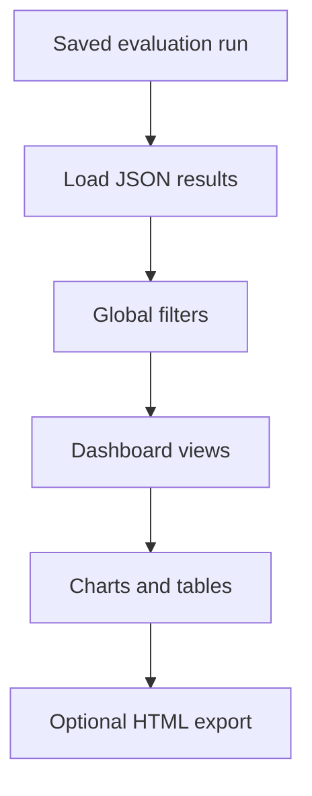

# Analysis

The optional Plotly Dash dashboard reads saved evaluation runs; it does not
perform generation. Install the dashboard extra before launching it.



## Launch the Dashboard

```powershell
# Interactive run selection
uv run --locked --all-extras python -m conductor_eval.analysis

# Direct path to a run
uv run --locked --all-extras python -m conductor_eval.analysis "$HOME\.conductor\eval\evaluations\20260210_224954_arpeggiator_local"
```

The dashboard opens at `http://127.0.0.1:8050/`. Pip users can run the same
module with `.\.venv\Scripts\python.exe` instead of the `uv run ... python`
prefix.

## Dashboard

### Global Filters

A filter bar at the top of every page lets you narrow results by:

- **Models** -- Select which models to include
- **Root Notes** -- Filter by root note (e.g. C, F#, Eb)
- **Scale Type** -- Major, minor, or both
- **Variation** -- Standard and reasoning effort levels

All charts update in real time when filters change.

### Dashboard Tabs

#### Tab 1: Overview
- Metric cards: total generations, pass rate, best/worst model, total cost, average latency
- Overall pass rate by model (horizontal bar chart)

#### Tab 2: Model Performance
- Per-test breakdown: scale vs duration vs overall pass rate per model
- Major vs minor pass rate comparison per model
- Model x scale heatmap
- Model x root heatmap

#### Tab 3: Root & Scale
- Pass rate by root note
- Major vs minor pass rate per root note
- Full model x root+scale heatmap

#### Tab 4: Latency
- Latency distribution box plots per model
- Latency vs pass rate scatter plot

#### Tab 5: Cost
- Total cost by model
- Cost per generation vs pass rate scatter plot

#### Tab 6: Reasoning *(only shown when `test_reasoning=True`)*
- Effort impact delta: pass rate change across effort levels per model
- Reasoning toggle comparison: pass rate with thinking on vs off for toggle-based models
- Reasoning cost-effectiveness: cost vs pass rate scatter colored by effort level

#### Tab 7: Error Patterns
- Generation failure rate (API/conversion errors) per model
- Most common incorrect pitch classes by model (as note names)
- Incorrect intervals relative to prompted root per model (e.g. m3, P5 -- helps identify systematic confusions)
- Incorrect durations by model showing actual vs requested duration

## Exporting

Click the **Export Dashboard** button to save all charts as individual HTML files plus a combined `dashboard.html` to `<evaluations-dir>/<run>/analysis/`. The number of exported charts depends on the run's features (16 base charts, plus 3 for reasoning when applicable):

```
~/.conductor/eval/evaluations/20260210_224954_arpeggiator_local/
└── analysis/
    ├── dashboard.html              # Combined single-page dashboard
    ├── pass_rate_by_model.html
    ├── per_test_breakdown.html
    ├── incorrect_intervals.html
    ├── effort_impact_delta.html    # Only if test_reasoning was used
    └── ... (up to 19 chart files total)
```

The exported HTML files are self-contained and can be shared without a running server.
