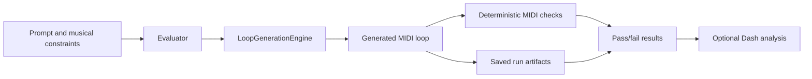

# Evaluation guide

Eval owns orchestration, deterministic checks, and result reporting. Core owns
generation and provider routing.



## Evaluator

### Basic Evaluation

```python
from conductor_eval import Evaluator

evaluator = Evaluator(temperature=0.0)

# Single prompt, multiple roots, one provider
results = evaluator.evaluate(
    prompts="an arpeggiator using only quarter notes",
    roots=["C", "G"],
    models="openai",
    run_name="quarter_note_test",
)
```

The evaluator automatically appends `" in {root} {scale}"` to each prompt and runs both major and minor scales for every root.

### Multiple Prompts

Test different musical patterns in a single run:

```python
results = evaluator.evaluate(
    prompts=[
        "an arpeggiator using only quarter notes",
        "an arpeggiator using only eighth notes",
        "an arpeggiator using only sixteenth notes",
    ],
    roots=["C", "D", "E", "F", "G", "A", "B"],
    models="all",
    run_name="duration_comparison",
)
```

### Model Selection

The `models` parameter accepts several formats:

| Value | Description |
|-------|-------------|
| `"all"` | All models from all providers (cloud + Ollama) |
| `"openai"` | All OpenAI models |
| `"anthropic"` | All Anthropic models |
| `"google"` | All Google Gemini models |
| `"ollama"` | All local Ollama models |
| `["gpt-5", "claude-sonnet-4-6"]` | Specific models by name |

Eval uses provider metadata to organize batches and reports, but generation
requests identify only the selected model. Conductor Core resolves the actual
provider route and records that provider with its generation artifacts.

### Testing Reasoning Variations

When `test_reasoning=True`, the evaluator tests all thinking modes and effort levels for compatible models:

```python
results = evaluator.evaluate(
    prompts="complex chord progression",
    roots=["C", "G"],
    models=["o3", "claude-sonnet-4-5"],
    run_name="reasoning_test",
    test_reasoning=True,
)
```

| Provider | Model Type | Variations |
|----------|------------|------------|
| OpenAI | `gpt-5.x` and `o`-series reasoning models | effort levels only; current families use `none` to `xhigh`, `minimal` to `high`, or `low` to `high` depending on model |
| Anthropic | Claude 4.x reasoning models | either effort levels only for Claude 5 models, `claude-opus-4-8`, `claude-opus-4-7`, `claude-opus-4-6`, `claude-sonnet-4-6`, or `standard` / `w_reasoning` toggle for other reasoning-capable Claude 4.x models |
| Google | Gemini 3.x and 2.5 reasoning models | Gemini 3.x uses effort levels; Gemini 2.5 models use `standard` / `w_reasoning` toggle |
| Ollama | All | standard only in the evaluator |

### Configuring Tests

The `tests` parameter controls which validation tests run on generated MIDI:

```python
results = evaluator.evaluate(
    prompts="an arpeggiator using only quarter notes",
    roots=["C"],
    models="openai",
    run_name="scale_only_test",
    tests=["scale"],  # Only run scale test, skip duration
)
```

| Test | Description | Auto-Detection |
|------|-------------|----------------|
| `scale` | Validates notes belong to the specified scale | Always uses root/scale from prompt |
| `duration` | Validates note durations match expected value | Detects from keywords: `quarter`, `eighth`, `sixteenth`, `16th`, `8th`, `half`, `whole` |
| `monophony` | Validates that completed notes never overlap | None; no parameters required |
| `polyphony` | Validates that the MIDI reaches a minimum number of simultaneous voices | None; set `min_voices` in `test_params` (default: `2`) |
| `chord_progression` | Validates diatonic chord pitch classes at fixed harmonic boundaries | None; set `progression` and optional `beats_per_chord`/`strict` in `test_params`; root and scale are supplied automatically |
| `harmonic_rhythm` | Validates that completed notes begin only at the expected beat positions | None; set `expected_onsets` in `test_params` |
| `chord_event_positions` | Validates that every completed note uses an expected start/end beat pair | None; set `expected_starts` and `expected_ends` in `test_params` |

The `scale` test always runs since root and scale are always applied to prompts. Duration keywords are owned by `conductor_core.music` as `DURATION_KEYWORDS` and shared with the evaluator. Parameters for the other tests are passed through `test_params`, keyed by test name.

## Output Structure

Each evaluation run creates a timestamped, unique directory beneath Eval's data
directory (shown here with the default suite root):

```
~/.conductor/eval/evaluations/
└── 20260210_224954_123456_my_first_eval-<hash>_<uuid16>/
    ├── run.log                    # Eval-owned lifecycle and error log
    ├── config.json                # Full evaluation configuration
    ├── summary.json               # Aggregated results + statistics
    ├── core_artifacts/            # Core-owned MIDI, messages, and metadata
    ├── analysis/                  # Created by dashboard export
    │   └── dashboard.html
    └── results/
        └── task-an_arpeggiator_using-<fingerprint>-1/
            ├── loop.mid           # Generated MIDI file
            ├── messages.json      # Chat history (for fine-tuning)
            └── test_results.json  # Individual test results and task metadata
```

When using `test_reasoning`, each variation receives its own task directory;
the variation is recorded in `test_results.json` rather than a subfolder:

```
# With test_reasoning=True
results/
├── task-an_arpeggiator_using-<fingerprint-none>-1/    # variation: none
├── task-an_arpeggiator_using-<fingerprint-low>-1/     # variation: low
├── task-an_arpeggiator_using-<fingerprint-medium>-1/  # variation: medium
├── task-an_arpeggiator_using-<fingerprint-high>-1/    # variation: high
└── task-an_arpeggiator_using-<fingerprint-xhigh>-1/   # variation: xhigh
```

### Core Artifacts
The evaluator intentionally retains `core_artifacts/` after copying MIDI and
messages into the report-oriented `results/` tree. Core owns generation
persistence, and retaining its canonical artifacts preserves provenance and
provider metadata for debugging. Eval does not selectively delete those files;
remove an entire completed run externally when its artifacts are no longer
needed.

### Directory Naming
Run directories include microseconds, a hash-backed 32-character run-name
component, and a 16-character UUID suffix. Each result is stored directly
beneath `results/` in a directory named:

```
task-<32-character sanitized prompt>-<16-character fingerprint>-<occurrence>
```

The fingerprint covers all task inputs and the occurrence always starts at
`1`, so repeated tasks remain distinct. A run or task directory collision
fails instead of overwriting artifacts. Result JSON metadata is authoritative;
the analysis loader does not infer meaning from directory names. 

### Logging
Each run owns
one non-propagating `run.log`, which records run start and completion plus
contextual task and run failures. Eval does not capture prompts, provider
payloads, or host/root logger output.

### Example JSON Schemas
#### config.json

Stores the full configuration used for the run:

```json
{
    "run_name": "my_first_eval",
    "timestamp": "20260207_143022_123456",
    "run_id": "20260207_143022_123456_my_first_eval-<hash>_<uuid16>",
    "prompts": ["an arpeggiator using only quarter notes"],
    "roots": ["C", "G"],
    "scales": ["major", "minor"],
    "models": [["OpenAI", "gpt-5"]],
    "tests": ["scale", "duration"],
    "test_reasoning": false,
    "temperature": 0.0
}
```

#### summary.json

Aggregated statistics for the entire run:

```json
{
    "run_id": "20260207_143022_123456_my_first_eval-<hash>_<uuid16>",
    "totals": {
        "total_generations": 48,
        "successful_generations": 45,
        "failed_generations": 3,
        "generation_error_generations": 2,
        "rate_limited_generations": 1,
        "check_error_generations": 0,
        "validation_failed_generations": 6,
        "ineligible_generations": 3,
        "eligible_generations": 42,
        "overall_pass_count": 36,
        "overall_pass_rate": 0.857,
        "total_cost": 1.25,
        "total_time": 120.5
    },
    "by_model": {
        "gpt-5": {
            "provider": "OpenAI",
            "tested": 24,
            "passed": 20,
            "pass_rate": 0.833,
            "total_cost": 0.50,
            "avg_latency": 2.1
        }
    },
    "by_root": { "C": { "tested": 24, "passed": 18, "pass_rate": 0.75 } },
    "by_scale": { "major": { "tested": 24, "passed": 20, "pass_rate": 0.833 } }
}
```

#### test_results.json

Individual results for each generation:

```json
{
    "task_id": "task-an_arpeggiator_using-<fingerprint>-1",
    "model": "gpt-5",
    "provider": "OpenAI",
    "prompt": "an arpeggiator using only quarter notes in C major",
    "original_prompt": "an arpeggiator using only quarter notes",
    "root": "C",
    "scale": "major",
    "config": {
        "use_thinking": false,
        "effort": null,
        "temperature": 0.0,
        "variation_name": "standard"
    },
    "metrics": {
        "api_latency": 2.34,
        "cost": 0.0025
    },
    "tests": {
        "scale": {
            "ran": true,
            "params": { "root": "C", "scale": "major" },
            "total": 16,
            "correct": 16,
            "incorrect": 0,
            "eligible": true,
            "status": "passed",
            "pitches": { "correct": [0, 2, 4, 5, 7, 9, 11], "incorrect": [] }
        },
        "duration": {
            "ran": true,
            "params": { "duration": "quarter" },
            "detected_from_prompt": true,
            "total": 16,
            "correct": 16,
            "incorrect": 0,
            "lengths": {}
        },
        "overall_pass": true,
        "overall_status": "passed"
    }
}
```
### Overall Pass

Overall pass rates use only eligible results as their denominator. Each result persists
an `overall_status` of `passed`, `failed`, `ineligible`, `generation_error`,
`rate_limited`, or `check_error`. 

A check with no examined notes is ineligible and can never make `overall_pass` true. A checker exception is a `check_error`, is excluded from pass-rate
denominators, and is reported separately from a musical validation failure.
